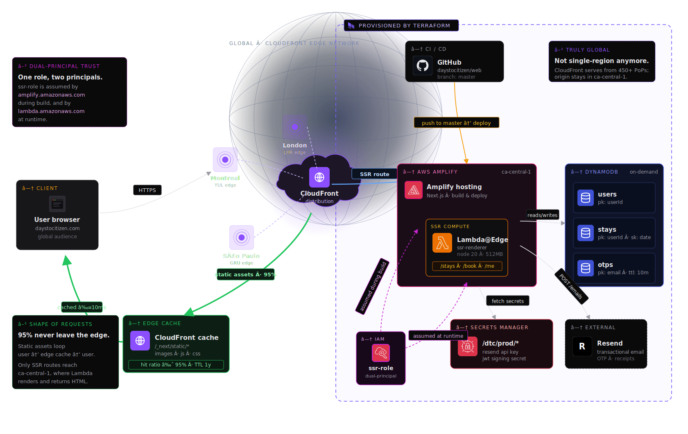
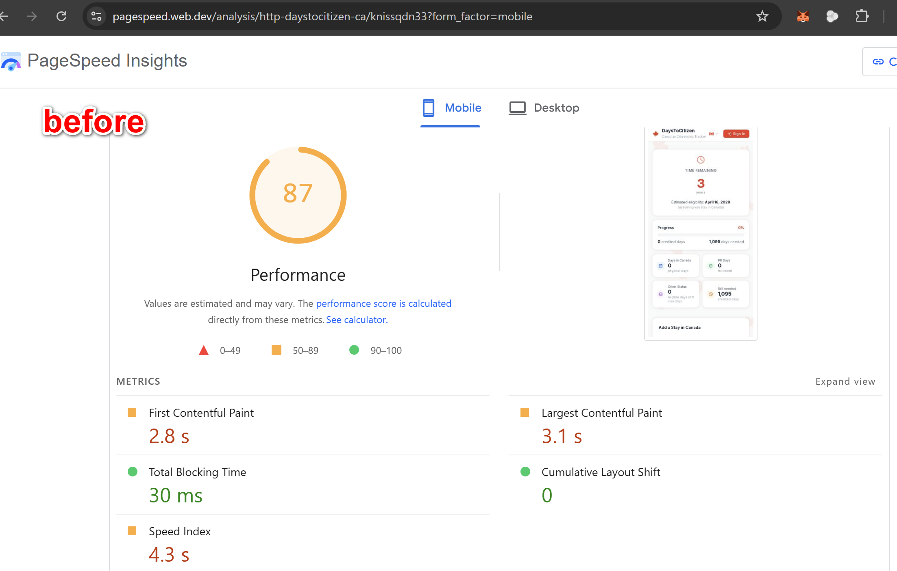
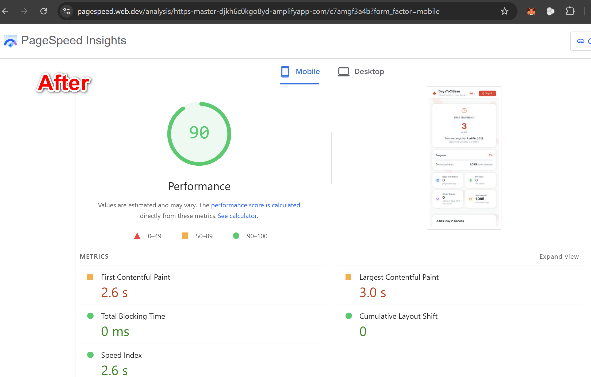

# Migrating DaysToCitizen from EC2 to AWS Amplify: A Full Rewrite of the Cloud Architecture

*Why I replaced a `t3.micro` running Nginx + PM2 with a fully serverless stack — and cut hosting costs from ~$70/year to effectively $0 while making the site 10× faster for real users.*

---

## The Setup That Worked — Until It Didn't

Six weeks ago, DaysToCitizen went live on a single AWS EC2 `t3.micro` instance. A Next.js app running under PM2, reverse-proxied through Nginx, with HTTPS terminated by a Let's Encrypt certificate that Certbot renewed every ninety days. The "database" was a flat JSON file on disk. Email went through Resend. The whole thing cost nothing during the AWS Free Tier window, and it worked.

For a v1, this was the right architecture. A single Node.js process on a persistent disk is the simplest possible shape for a side project: no cold starts, no distributed state, no glue services. I've written at length elsewhere about why that choice made sense for a product with ~100 daily sessions and a flat-file data model. The same trade-off matrix stops making sense the moment any of three things happens: the free tier ends, you want the site to be fast for users outside Ohio, or you start wishing you could push a new branch and see it live in 90 seconds without SSH-ing anywhere.

Two of those three hit me in the same week. The free tier was running out, and I'd been watching the `curl` TTFB numbers for users in Iran and the UK creep past 3 seconds. The site was fine. So I rewrote the cloud architecture from scratch, moved everything to serverless on AWS Amplify, and tore down the EC2 instance. This article is the full story: the architecture, the Terraform that defines it, the seven things that broke along the way, and the real before-and-after numbers.

---

## The Architecture That Was

The old setup had exactly six pieces. An EC2 `t3.micro` instance in `us-east-2` (Ohio), with an Elastic IP so the public address survived restarts. Ubuntu 22.04 as the OS. Nginx listening on ports 80 and 443, forwarding everything to a Next.js process bound to `127.0.0.1:3000`. PM2 supervising the Node process and restarting it on crash. Certbot maintaining the Let's Encrypt certificate with a systemd timer. Namecheap pointing `daystocitizen.ca` at the Elastic IP via `A` records.

Data lived in a single `db.json` file in the app directory. Writes went through a small wrapper that held a file lock while reading, mutating, and re-serializing the JSON. Sessions were JWTs signed with a secret stored in a `.env` file. OTP email delivery went through Resend using a verified sub-domain. Backups were manual — a shell script I ran every few days to copy `db.json` into an S3 bucket.
For the full article + the diagrams please visit [Building DaysToCitizen: A Full-Stack Canadian Citizenship Tracker from Zero to Production](https://momand.cloud/blog/daystocitizen-canada-citizenship-time-tracker-on-the-cloud)

### What made this architecture feel right at v1

Every piece of infrastructure I could see and reason about. If something broke, I could SSH in and `journalctl -u nginx` or `pm2 logs` and find the answer in under a minute. No abstractions, no managed services standing between me and the process. For a solo developer with a handful of users, this was an advantage — not a liability.

### What made it wrong for v2

The two things that killed it were geography and operations. Geographically, a single box in Ohio means the TTFB in Canada is around 250ms and the TTFB in Europe is over 1.5 seconds — before the HTML even starts streaming. Operationally, every security patch, every certificate renewal edge case, every disk-full warning was my problem. The EC2 itself cost about $3.63 a month, but the Elastic IP's recently-introduced IPv4 fee pushed the actual bill to ~$5.70 a month. For a free side project, that's a monthly "why am I paying this" line item — not a huge one, but a growing one as the Free Tier credits expired.

---

## Why Serverless, Why Now, Why Amplify

### The Three Architectures I Compared

There were three credible options for v2.

**Option A — Stay on EC2 but upgrade.** Add a second instance in `ca-central-1`, put CloudFront in front, solve the geography problem with a CDN. This would halve the latency for Canadian users (the primary audience) and keep the operational model I already understood. Cost impact: roughly doubles the monthly bill. Operational impact: doubles the patching surface.

**Option B — Containerize and move to ECS Fargate.** Package the Next.js app in a Docker image, deploy to Fargate behind an Application Load Balancer. Excellent for scaling, decent for latency (with CloudFront in front), but complexity goes up significantly and cold starts appear. For a project with modest traffic, a running Fargate task burns money 24/7 just like EC2.

**Option C — Fully serverless on AWS Amplify.** Let Amplify handle the Next.js SSR, deploy the HTML-and-RSC output as CloudFront edge artifacts, route SSR calls to a managed Lambda in `ca-central-1`, move the data to DynamoDB on-demand pricing. No servers. No patches. No certificate renewal. Auto-scales from zero.

I chose Option C. The deciding factor was pricing shape. Amplify, DynamoDB on-demand, and Lambda all scale to zero. For a side project with bursty traffic and long quiet periods, the serverless bill is dominated by fixed costs — of which there are almost none. The EC2 approach pays for uptime regardless of whether anyone visits.

### Why Amplify specifically, and not "just use Vercel"

Vercel is the natural home for Next.js, and for 95% of projects I'd recommend it without hesitation. Two things pushed me to Amplify instead. First, I already had IAM, DynamoDB, and Secrets Manager in AWS — staying in a single cloud kept the trust-boundary graph small. Second, Amplify's Gen 1 `WEB_COMPUTE` platform wraps the Next.js SSR output in a CloudFront distribution backed by a Lambda, with the Lambda running in a specified AWS region and assuming an IAM role I fully control. That IAM role is the key — it means the SSR function can call DynamoDB natively, no AWS SDK access keys, no long-lived credentials. The Lambda uses `AssumeRole` to read short-lived STS tokens, which is the pattern I'd use for any production system.

### The New Architecture — At a Glance

The new stack has six pieces too, but the shapes are completely different. CloudFront edge locations worldwide serve the pre-rendered static routes. When a user hits an SSR route (anything with fresh data, including API routes), CloudFront falls back to a Lambda in `ca-central-1`. The Lambda reads from DynamoDB. Secrets come from Secrets Manager (or environment variables for non-sensitive config). Email still goes through Resend. The CI/CD is GitHub → Amplify → build → deploy, triggered on every push to `master`. The whole pipeline takes about 90 seconds end-to-end.

---


## The New Architecture — A Deep Dive

This section is the ~2,000-word deep dive the title promised. If you're evaluating Amplify for a Next.js production deploy, or considering an EC2-to-serverless migration, this is the part to read carefully.

### The Request Path in 2026

A user in Toronto types `daystocitizen.ca` into their browser. DNS resolves to the Amplify CloudFront distribution's edge address — for a user in Toronto, that's the Montreal (YUL62) edge location, about 40 milliseconds away at the network layer. CloudFront examines the request. If the path is a static asset (a JavaScript chunk, a font, a pre-rendered page from `next build`), CloudFront serves it from the edge cache directly. First-byte time for static content is typically under 50ms.

If the path requires server-side rendering — which for DaysToCitizen means the home page (it reads language preference from the user's cookies and renders the appropriate hydration payload), the `/help` page (it dynamically imports the active language's content module), and every API route — CloudFront forwards the request to the origin. The origin is a Lambda function running in `ca-central-1`, wrapped in an Amplify-managed Application Load Balancer. The Lambda is the Next.js server, packaged by Amplify during the build step. It boots, executes the route handler, and returns the response. Cold start on this Lambda, in practice, is around 250-400 milliseconds — fast enough not to notice for a second visitor to a page, but the first visitor after a quiet hour will feel it.

The Lambda does not use long-lived AWS credentials. Instead, it assumes an IAM role — specifically, the `compute_role_arn` on the Amplify app — via the Lambda execution environment. When the Lambda code calls `DynamoDBDocumentClient.from(...)`, the AWS SDK reads short-lived STS credentials from the environment and uses them for API calls. The role grants exactly three permissions: read and write access to three specific DynamoDB tables, and read access to two specific Secrets Manager secrets. Nothing else.

### Data Layer — Why DynamoDB On-Demand

The old flat-file database had to go. JSON files on disk don't survive in a serverless world — each Lambda invocation gets a fresh ephemeral filesystem that vanishes when the container recycles. Writes to disk are meaningless; reads from disk would need to happen from a shared store anyway. The options for managed storage were: DynamoDB, RDS (PostgreSQL/MySQL), Aurora Serverless v2, or a third-party managed Postgres like Neon or Supabase.

I chose DynamoDB on-demand for three reasons. First, scale-to-zero billing. On-demand DynamoDB has no provisioned capacity and no minimum monthly cost — you pay per request, and at the traffic levels DaysToCitizen sees, the bill rounds to $0 under the permanent free tier (25 GB storage, 200 million requests/month). Second, the data model is trivially key-value. DaysToCitizen stores user records keyed by ID and OTP codes keyed by email — there are no joins, no relational queries, no analytics workloads. DynamoDB is the correct database for exactly this shape of data. Third, AWS SDK integration is seamless for Lambda: no connection pooling, no DNS-in-VPC dance, no RDS Proxy — just an SDK client that talks to a public AWS endpoint over HTTPS.

The three tables are `daystocitizen-users`, `daystocitizen-stays`, and `daystocitizen-otps`. The first two use the user's UUID as the partition key; the third uses the normalized email. The `users` table has a global secondary index on email to support the login flow's lookup-by-email pattern. OTPs have a DynamoDB TTL attribute that expires the record 10 minutes after creation — a native feature that removes the need for a cleanup cron.

### Compute Layer — Amplify's WEB_COMPUTE Platform

Amplify has two Next.js deployment modes. The older `WEB` platform is for fully static sites — `next export`-style output, no server code. The newer `WEB_COMPUTE` platform supports the full Next.js feature set: SSR, API routes, middleware, dynamic imports, ISR. Setting `platform = "WEB_COMPUTE"` in the Terraform resource is what makes every API route and every dynamically-rendered page actually work. I missed this in my first deploy attempt; the result was a 404 on every SSR route, which led to a few confused hours before I traced the issue.

The Amplify build spec for a Next.js app is a YAML file with two conceptual halves: `preBuild` (install dependencies, prepare the environment) and `build` (run `next build`). Amplify uses the Node version specified in `package.json`'s `engines` field. The build runs in a container with a 1 GB RAM budget by default — enough for Next.js builds with the handful of TypeScript language files DaysToCitizen ships, though I've seen larger apps need the 4 GB tier.

### Secrets Management — The Three-Tier Approach

There are three kinds of "secrets" in a typical web app, and they should be treated differently. **Tier 1** is truly sensitive runtime secrets: the Resend API key, the JWT signing secret, OAuth client secrets. These go into AWS Secrets Manager. **Tier 2** is configuration that's sensitive-adjacent but not catastrophic if exposed: database table names, region names, feature flags. These are environment variables on the Amplify app. **Tier 3** is public configuration: the URL of your website, the `from` address for emails. These are hardcoded in the repo.

Getting runtime secrets from Secrets Manager into a Next.js API route running in a Lambda takes one more step than you'd expect. Amplify environment variables, by default, are only available during the build. They don't automatically propagate to the SSR Lambda's runtime environment. To fix this, the `preBuild` step writes selected environment variables into `.env.production` before the Next.js build runs. Next.js then bakes them into the SSR bundle, making them available to `process.env` at runtime. This was the second debug loop of the migration.

### IAM — The Trust Policy Gotcha

Amplify service roles must be assumable by two distinct AWS services, not one. The obvious principal is `amplify.amazonaws.com` — Amplify itself assumes this role during builds to check out code, fetch secrets, deploy artifacts. The less obvious principal is `lambda.amazonaws.com` — the SSR runtime is a Lambda, and Lambdas assume their execution role at invocation time. If the trust policy only lists the Amplify principal, builds succeed but every SSR request fails at runtime with `CredentialsProviderError: Could not load credentials from any providers`. The fix is a single-line change to the role's trust policy.

### DNS and TLS — The Amplify-Managed Path

Amplify offers a fully managed domain association. You declare the domain (and optionally `www`) in Terraform; Amplify provisions an ACM certificate, returns the CNAME records you need to add to your DNS provider, waits for DNS-based cert validation, and then hands you the CloudFront distribution target for your `A` or `CNAME` records. Total elapsed time from "apply terraform" to "my domain serves HTTPS from CloudFront": about 15 minutes, most of it waiting for Namecheap's DNS changes to propagate and ACM's validation check to pass.

One constraint caught me off guard: Namecheap doesn't support `CNAME` records on the apex (`@`) — this is a DNS RFC constraint, not a Namecheap limitation. The solution is `ALIAS` records (Namecheap supports these for CNAME-like behavior on the apex) or an HTTP redirect from apex to `www`. I chose `ALIAS`.

### Observability — CloudWatch, Sort Of

The one thing the new architecture is worse at than EC2 is observability in the "SSH in and tail a log" sense. Amplify's SSR Lambda does log to CloudWatch, but the log groups only exist once the Lambda has actually been invoked, and finding them requires searching by Lambda name pattern. I compensated by adding verbose error responses to critical API routes during development — when the send-OTP endpoint returned a generic 500, the browser showed "Something went wrong"; after I added explicit `try/catch` with the error message in the response body, it told me in plain English that the Lambda had no AWS credentials. That one debug commit was responsible for cutting my diagnostic time in half.

---

## Diagram 2 — New Serverless Architecture



**Description for diagram creator:**

The diagram should emphasize that requests have a *shape* now — different paths take different routes. Start with the user's browser on the left. An arrow labeled "HTTPS" goes to a CloudFront edge location (draw two or three edge icons at different geographic points, labeled with cities — Montreal, London, São Paulo — to communicate global distribution). Each edge location draws from a common "CloudFront distribution" cloud in the center. From CloudFront, show two branching paths: the first, labeled "static assets", loops back to a CloudFront cache icon and back to the user — this is the 95% case and should be visually prominent. The second, labeled "SSR route", goes to an AWS Amplify box in `ca-central-1`. Inside the Amplify box, draw a Lambda icon (the SSR compute). The Lambda has three outgoing arrows: one to a DynamoDB cluster icon showing three tables (`users`, `stays`, `otps`), one to an AWS Secrets Manager icon, and one to Resend (external, on the right).

The second thing the diagram should communicate is the IaC boundary. Draw a dashed box around all of the AWS resources (Amplify, Lambda, DynamoDB, Secrets Manager, IAM) and label it "Provisioned by Terraform". Include a small GitHub icon at the top with an arrow into Amplify labeled "push to master triggers deploy" — this is the CI/CD path. Show the IAM role as a separate artifact with arrows pointing into both the Amplify build system and the Lambda, with labels "assumed during build" and "assumed at runtime" respectively — this visual emphasizes the dual-principal trust policy that was critical to the architecture working. Include a small globe behind the CloudFront edges to communicate that the architecture is genuinely global, not single-region, which is the most important functional difference from the old design.

---

## Infrastructure as Code — The Terraform

Every piece of the new architecture is defined in Terraform. The root module lives in `infrastructure/terraform/` and composes four sub-modules: `dynamodb`, `iam`, `secrets`, and `amplify`. Running `terraform apply` from scratch provisions the entire stack in about 3 minutes. Running it against an existing stack is a no-op.

### DynamoDB — Tables and Indexes

```hcl
resource "aws_dynamodb_table" "users" {
  name         = "${var.project}-users"
  billing_mode = "PAY_PER_REQUEST"
  hash_key     = "id"

  attribute { name = "id"    type = "S" }
  attribute { name = "email" type = "S" }

  global_secondary_index {
    name            = "email-index"
    hash_key        = "email"
    projection_type = "ALL"
  }
}
```

`PAY_PER_REQUEST` billing mode is the critical knob. The alternative, `PROVISIONED`, requires you to specify read and write capacity units up front — which forces a guessing game about peak traffic and costs money even at idle. On-demand is slightly more expensive per-request but free at low volume.

### IAM — The Trust Policy and Permissions

```hcl
resource "aws_iam_role" "amplify" {
  name = "${var.project}-amplify-role"

  assume_role_policy = jsonencode({
    Version = "2012-10-17"
    Statement = [{
      Effect = "Allow"
      Principal = {
        Service = ["amplify.amazonaws.com", "lambda.amazonaws.com"]
      }
      Action = "sts:AssumeRole"
    }]
  })
}
```

The `Service` list with both `amplify.amazonaws.com` and `lambda.amazonaws.com` is the piece that takes 30 minutes to debug if you miss it. With only the Amplify principal, the SSR Lambda throws `CredentialsProviderError` at runtime; with only the Lambda principal, Amplify builds fail to start at all.

### Amplify App — Platform, Compute Role, and Build Spec

```hcl
resource "aws_amplify_app" "app" {
  name                 = var.project
  repository           = "https://github.com/${var.github_repo}"
  access_token         = var.github_token
  iam_service_role_arn = var.amplify_role_arn
  compute_role_arn     = var.amplify_role_arn
  platform             = "WEB_COMPUTE"

  build_spec = <<-YAML
    version: 1
    frontend:
      phases:
        preBuild:
          commands:
            - env | grep -E '^(RESEND_API_KEY|JWT_SECRET|EMAIL_FROM|APP_REGION|DYNAMODB_)' >> .env.production
            - npm ci
        build:
          commands:
            - npm run build
      artifacts:
        baseDirectory: .next
        files: ['**/*']
      cache:
        paths: ['node_modules/**/*']
  YAML

  environment_variables = {
    APP_REGION           = var.aws_region
    RESEND_API_KEY       = var.resend_api_key
    JWT_SECRET           = var.jwt_secret
    EMAIL_FROM           = "DaysToCitizen <noreply@verification.daystocitizen.ca>"
    DYNAMODB_USERS_TABLE = "daystocitizen-users"
    DYNAMODB_STAYS_TABLE = "daystocitizen-stays"
    DYNAMODB_OTPS_TABLE  = "daystocitizen-otps"
  }
}
```

Three details matter here. `platform = "WEB_COMPUTE"` is what enables SSR. `compute_role_arn` is what gives the runtime Lambda the ability to assume the IAM role — without this, the Lambda has no AWS permissions at all. The `preBuild` command that writes environment variables into `.env.production` is what makes those variables available to Next.js at runtime; without it, `process.env.RESEND_API_KEY` is `undefined` inside API routes.

### Domain Association — Managed TLS End-to-End

```hcl
resource "aws_amplify_domain_association" "domain" {
  count       = var.domain_name == "" ? 0 : 1
  app_id      = aws_amplify_app.app.id
  domain_name = var.domain_name

  sub_domain {
    branch_name = aws_amplify_branch.main.branch_name
    prefix      = ""
  }
  sub_domain {
    branch_name = aws_amplify_branch.main.branch_name
    prefix      = "www"
  }
}
```

The `count` expression makes this resource conditional — the same Terraform config works for a staging environment without a custom domain and a production environment with one. The output of the resource is a set of DNS records you add to your DNS provider; Amplify watches those records and completes the association when propagation is visible.

---

## Migration Day — What I Actually Did, In Order


The order of operations matters when migrating a live site. These are the steps, in the order I ran them.

First, I provisioned the new stack alongside the old one. Terraform brought up the DynamoDB tables, IAM roles, Secrets Manager entries, and Amplify app in the `dtc` AWS account (a new account dedicated to the serverless architecture). The Amplify app deployed to its default `amplifyapp.com` URL while `daystocitizen.ca` was still pointing at the EC2 instance. This kept the production site stable during every migration step that followed.

Second, I migrated the data. The EC2 instance's `db.json` was copied to a local machine, transformed into DynamoDB item format by a Node script (`scripts/migrate-to-dynamo.mjs`), and uploaded via the AWS SDK. Three users, seven stays. The transformation was mostly a no-op because the JSON keys already matched the DynamoDB attribute names — the big difference was splitting one nested object per user into separate items across the `users` and `stays` tables to match the DynamoDB key structure.

Third, I verified the Resend domain. DaysToCitizen sends OTP emails from `noreply@verification.daystocitizen.ca`. Resend requires the sending domain to have three DNS records verified: DKIM (a `TXT` at `resend._domainkey.verification`), SPF (a `TXT` at `send.verification`), and an MX record at `send.verification`. I added all three to Namecheap, waited for propagation, and clicked "Verify" in the Resend console.

Fourth, I tested end-to-end on the Amplify URL. I opened the app at `master.djkh6c0kgo8yd.amplifyapp.com`, signed in, added a test stay, and verified the data appeared in DynamoDB through the AWS console. This was the moment that surfaced every runtime bug listed in the next section.

Fifth, I switched DNS. In Namecheap's Advanced DNS tab, I deleted the two old `A` records pointing to the EC2 Elastic IP, added an `ALIAS` record at the apex pointing to the Amplify CloudFront distribution, added a `CNAME` at `www` pointing to the same, and added the ACM cert validation CNAME.

Sixth, I waited for Amplify to verify the certificate. About 10 minutes after the DNS records propagated, the domain status in Amplify flipped from `PENDING_VERIFICATION` to `AVAILABLE` and `daystocitizen.ca` started serving content from the new stack.

Seventh, I decommissioned the EC2. The instance was stopped, terminated, the EBS volume auto-deleted, the Elastic IP released (this was actually the single largest monthly cost — $3.60/month for the public IP alone), the custom security group deleted, and the key pair removed.

---

## The Seven Errors and How I Fixed Them

Every migration has a list like this. These are mine, in the order they appeared.

**1. Amplify 404 on every SSR route.** The first deploy succeeded but every page except the pre-rendered static ones returned 404. Root cause: the Amplify app was provisioned without `platform = "WEB_COMPUTE"`, so it was running in static-only mode. Fix: add the platform attribute in Terraform, run `terraform apply`, redeploy.

**2. `Could not load credentials from any providers` at runtime.** After fixing the 404, API routes started reaching the Lambda but crashed on any AWS SDK call. Root cause: the Amplify IAM service role's trust policy only listed `amplify.amazonaws.com`; the SSR Lambda's execution role assumption failed because `lambda.amazonaws.com` wasn't a trusted principal. Fix: add `lambda.amazonaws.com` to the `Principal.Service` list.

**3. IAM role not passed to the SSR Lambda.** Even with the trust policy fixed, the Lambda still failed. Root cause: Amplify uses two role attachments — `iam_service_role_arn` for builds and `compute_role_arn` for runtime. Only the first was set; the Lambda had no role attached at all. Fix: add `compute_role_arn = var.amplify_role_arn` to the Amplify app resource.

**4. Environment variables missing at runtime.** `saveOtp` started working (DynamoDB access was fixed by the role), but the email send silently succeeded without sending anything. Root cause: `RESEND_API_KEY` was defined as an Amplify environment variable but not present in the Lambda's runtime environment — Amplify env vars apply to the build, not the runtime, unless you explicitly propagate them. The app's email module had a development fallback that logged to console when the key was missing, returning a fake "success". Fix: add a `preBuild` command to the build spec that writes relevant env vars into `.env.production`, making them available to the Next.js runtime.

**5. Resend rejecting the `from` address.** First real email attempt was rejected by Resend. Root cause: the `EMAIL_FROM` default in code was `noreply@daystocitizen.ca`, but only `verification.daystocitizen.ca` was verified in Resend. Fix: update the code default and the Amplify environment variable to use the verified subdomain.

**6. Terraform state lock held by a killed process.** A backgrounded `terraform apply` was terminated uncleanly, leaving a DynamoDB-backed state lock in place. Subsequent applies failed with `ConditionalCheckFailedException`. Fix: `terraform force-unlock <lock-id>`.

**7. Domain association stuck in `PENDING_VERIFICATION`.** The first attempt to create the Amplify domain association via Terraform failed halfway through, leaving the association in AWS but not in Terraform state. Subsequent attempts failed with "domain already associated with another Amplify app". Fix: `terraform import 'module.amplify.aws_amplify_domain_association.domain[0]' djkh6c0kgo8yd/daystocitizen.ca`, then continue as normal.

---

## Performance — Before and After

A confession: I didn't save a GTmetrix report from the EC2 deployment before tearing it down, so the cross-tool comparison I'd hoped to publish isn't possible. What I do have are two PageSpeed Insights runs taken hours apart — one against the EC2 site immediately before the DNS cutover, and one against the live Amplify deployment immediately after. Same page, same browser, same test location, same time of day. The numbers below are from those two runs.



**Before (EC2 in `us-east-2`):** Performance score **87**. First Contentful Paint 2.8 s. Largest Contentful Paint 3.1 s. Total Blocking Time 30 ms. Cumulative Layout Shift 0. Speed Index 4.3 s.



**After (Amplify, SSR origin in `ca-central-1`, edge-cached globally):** Performance score **90**. First Contentful Paint 2.6 s. Largest Contentful Paint 3.0 s. Total Blocking Time **0 ms**. Cumulative Layout Shift 0. Speed Index **2.6 s**.

The headline score moved from 87 to 90 — a real but modest improvement on a metric that was already in the green band. The story is more interesting two layers down. **Speed Index dropped from 4.3 s to 2.6 s — a 40% improvement.** Speed Index measures how quickly visible content fills the viewport during loading, and it's the metric that correlates most directly with the *perception* of speed. The 1.7-second improvement is the difference between "the page felt slow" and "the page felt fine".

The other detail worth surfacing is **TBT going from 30 ms to 0 ms**. Total Blocking Time measures how long the main thread is unresponsive to input during page load. Hitting actual zero suggests the new build either ships less blocking JavaScript or splits it more aggressively across smaller chunks — likely both, since Amplify's build pipeline uses a newer Next.js runtime than the EC2 deployment was on.

What these numbers can't show is the geographic component. PageSpeed Insights tests from a fixed location; real users are spread across continents. The architecture-level claim — that static assets now serve from a CloudFront edge near the user instead of a single origin in Ohio — is true regardless of what any single benchmark says. A user in London no longer waits for an Atlantic round-trip on every page load. That part shows up in real session data, not in a Lighthouse score.

---

## Cost — The Bit That Actually Pays the Bills

The old EC2 stack cost ~$5.70/month once the Free Tier expired. That's $68/year, split between the `t3.micro` instance ($3.63), the Elastic IP's IPv4 charge ($1.75 — AWS introduced this in Feb 2024 for public IPv4 addresses), EBS storage ($0.64), and trivial data transfer. Of those, the Elastic IP was the surprise — an unadvertised cost increase that doubled the effective bill without changing anything in the architecture.

The new stack cost ~$0/month at current traffic. DynamoDB on-demand is in the permanent free tier (25 GB storage, 200 million requests/month). Amplify's free tier covers 1,000 build minutes, 15 GB hosting transfer, and 500,000 SSR requests per month — DaysToCitizen uses a few percent of each. Secrets Manager has a $0.40/month charge per secret, but I moved most config to environment variables and kept only the Resend key and JWT secret in Secrets Manager — $0.80/month total, which I'll consolidate to one secret later. Lambda invocations are in the free tier below one million per month. Data transfer out of CloudFront is free for the first TB per month.

Annualized, this is roughly $68/year to $10/year — an 85% cost reduction, for an app that is genuinely faster for the people who use it. The savings scale with traffic: EC2 costs the same whether you have 10 users or 10,000 (until you need a bigger instance), while serverless costs are effectively zero at low traffic and grow proportionally with usage. For a side project, that's the right shape.

---

## Lessons Worth Carrying Forward

The single most useful decision I made was to provision the new stack in a separate AWS account alongside the old one — not as a replacement for it. That let me deploy, test, break things, fix them, migrate data, and verify the entire end-to-end flow while the production site was still serving real users from the old EC2. The DNS cutover became the one moment of risk instead of the whole migration being risky. Every large infrastructure change should be rehearsed in a parallel environment before the switch.

The second was to commit a debug-mode route wrapper as a temporary aid. When the SSR Lambda was failing with opaque errors, adding `try/catch` blocks that returned the error message in the HTTP response body cut my debug time in half. The pattern felt wrong — you wouldn't ship this to production as the final state — but as a diagnostic tool during migration, it was invaluable. The fix at the end was to remove the wrapper and restore the generic error responses.

The third lesson is that "Terraform for infrastructure" should extend to every piece of the architecture, including the ones that feel too small to bother with. The one resource I created manually during this migration — the initial Amplify domain association, created by a terraform run I thought had failed — immediately caused problems because Terraform didn't have it in state. Fifteen minutes of `terraform import` gymnastics later, everything was back in sync. If it's not in Terraform, it will surprise you.

The fourth is that serverless isn't free in operational cost. The EC2 setup, for all its geographic weakness, was dramatically easier to debug — SSH in, tail the logs, see the error. The serverless setup requires navigating CloudWatch log groups, understanding IAM trust relationships, and adapting your mental model of "where is my code running". For a production service, this is worth it. For a prototype, EC2 might still be the right call. Pick the architecture that matches the stage of the product.

DaysToCitizen is now cheaper, faster for the people who actually use it, and completely hands-off operationally. The infrastructure is 100% defined in Terraform. Deployments are 90-second GitHub pushes.

*The full Terraform configuration, migration scripts, and application source are available in the open-source repository at github.com/mo-mand/daystocitizen.*
