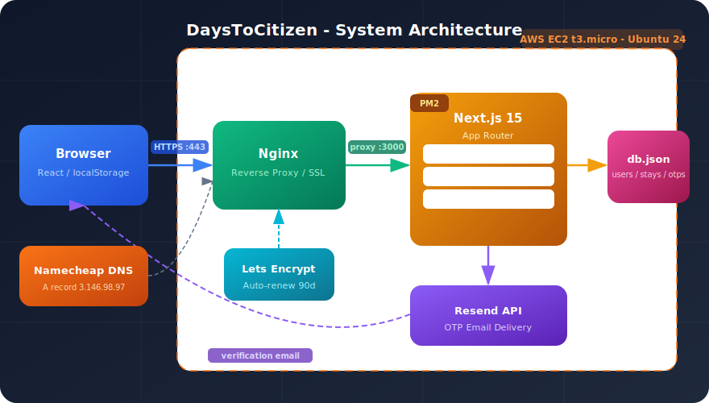
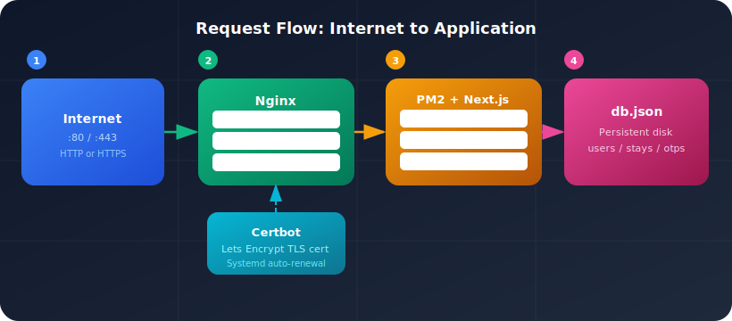
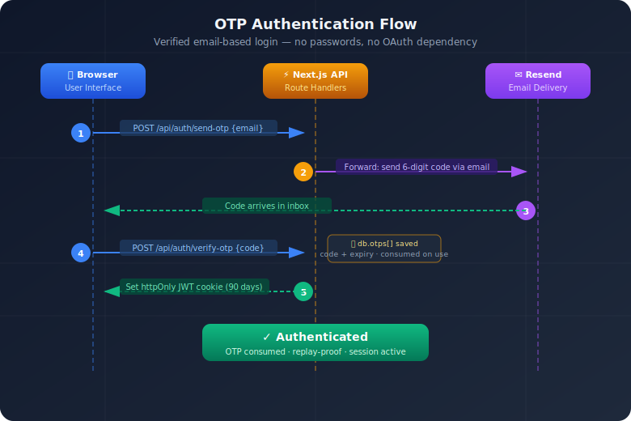

# Building DaysToCitizen: A Full-Stack Canadian Citizenship Tracker from Zero to Production

*A technical, architectural, and business deep-dive into building a real product — covering date math edge cases, 23-language i18n, secure OTP authentication, and deploying to AWS with HTTPS.*

---

## The Problem Worth Solving

Every year, tens of thousands of people receive Canadian Permanent Residency. Before they can apply for citizenship, they must prove **1,095 days of physical presence in Canada** within the last 5 years — a number tracked by IRCC (Immigration, Refugees and Citizenship Canada). The stakes are high: miscounting can mean rejection, delays of months, or being locked out of citizenship entirely.

Most immigrants track this in spreadsheets, notes apps, or simply rely on memory. I couldn't find a tool that is simple, fits on a single page, requires no lengthy onboarding questionnaire, and actually stores your data online — while also correctly accounting for IRCC's own counting rules (both arrival and departure days count), multiple immigration statuses, and the complexity of living between countries.

**DaysToCitizen** solves this. It is a free, open-source web application where immigrants enter their stays outside Canada and instantly see their eligibility countdown, how many days they've accumulated, and how many they still need.

> **Screenshot placeholder 1**: The main dashboard showing the countdown card and stats with a sample data set.

**Measurable outcomes:**
- A user who would have miscounted by even 2–3 days (common with off-by-one errors in manual tracking) could incorrectly believe they qualify — or unnecessarily delay applying
- With 23 supported languages including Farsi, Arabic, Punjabi, Hindi, Urdu, and Chinese, the tool reaches immigrants in their own language — the majority of Canada's new PRs come from these language groups
- Zero cost to users, zero ads, privacy-first (data stays local unless they choose to create an account)
- Open source — the full codebase is publicly available for anyone to audit, fork, or self-host

---

## Technical Stack — What We Chose and Why

| Layer | Choice | Why |
|-------|--------|-----|
| Framework | Next.js 15 (App Router) | SSR + API routes in one repo, no separate backend |
| Language | TypeScript | Catch bugs at compile time, especially date math |
| Styling | Tailwind CSS | Fast iteration, no CSS files to manage |
| Date math | date-fns | Explicit, immutable, tree-shakeable |
| Auth | JWT + OTP via Resend | Passwordless, no OAuth dependency |
| Storage | JSON flat file (`db.json`) | No database server, survives on a t3.micro |
| Deployment | AWS EC2 + Nginx + PM2 | Full control, 6-month credit eligible, HTTPS via certbot |

**The decision to avoid a database:** Most SaaS tutorials reach for PostgreSQL or MongoDB immediately. For a v1 with a single server and a user base measured in thousands, a JSON file protected by file-system writes is entirely sufficient — and eliminates an entire class of infrastructure complexity. The trade-off is no horizontal scaling and no concurrent write safety, but for a single-instance personal-data app this is the right call.

---

## Architecture Overview



---

## Cloud Architecture — A Deep Dive

This section is intentionally detailed for engineers evaluating the same decisions.

### The Infrastructure Choice: EC2 vs. Serverless vs. PaaS

Three options were on the table:

**Option A — Vercel (PaaS):** The natural home for Next.js. Zero-config deploy, automatic HTTPS, global CDN. The trade-off: Vercel's free tier does not support persistent filesystem writes — our entire flat-file database approach would fail. Moving to a managed database (PlanetScale, Supabase, Neon) adds cost and complexity that isn't justified at v1.

**Option B — AWS Lambda + API Gateway (Serverless):** Maximum scalability, pay-per-request. The trade-off: cold starts, inability to write to disk, no persistent process state, and a significantly more complex deployment pipeline. Also overkill — a citizenship tracker does not need to handle 10,000 concurrent users at launch.

**Option C — AWS EC2 t3.micro (chosen):** A persistent virtual machine. Full control over the filesystem, process management, and network. Covered under the AWS Free Tier credit (6 months in this case). The trade-off: manual operations (upgrades, restarts, certificate renewal), single point of failure, no auto-scaling.

**Decision rationale:** The flat-file database was the deciding constraint. It requires a persistent disk and a single process. EC2 is the only option that satisfies this at zero marginal cost. When the app scales and a real database is warranted, migration to a serverless or container-based architecture becomes straightforward.

### Network Layer: Nginx as Reverse Proxy



Next.js runs on port 3000, bound only to `localhost`. Nginx listens on ports 80 and 443 and forwards traffic. This is a critical security pattern — the application process is never directly exposed to the internet.

**Why PM2?** Node.js is single-threaded and crashes are possible. PM2 is a process manager that:
- Restarts the app if it crashes
- Starts it automatically on server reboot (`pm2 startup` + `pm2 save`)
- Provides log aggregation and monitoring

**HTTPS via Let's Encrypt:** Certbot's `--nginx` flag is elegant — it reads the Nginx config, finds the matching `server_name`, generates a certificate, modifies the config to add SSL directives, and sets up an auto-renewing systemd timer. Certificates expire every 90 days; renewal is fully automated.

### DNS Architecture: Namecheap + Elastic IP

A subtle but important AWS decision: EC2 instances get a new public IP every time they restart unless you assign an **Elastic IP**. Without it, your DNS records break every time the instance stops. Elastic IPs are free as long as they're attached to a running instance.

The Namecheap DNS configuration:
- `A @ → 3.146.98.97` (root domain)
- `A www → 3.146.98.97` (www subdomain)
- `TXT/MX records for verification.daystocitizen.ca` (Resend email subdomain)

Using a subdomain (`verification.daystocitizen.ca`) for transactional email is best practice — it isolates email reputation from the main domain's web reputation. The full story of configuring Resend with custom domains, SPF/DKIM/DMARC records, and deliverability is covered in a dedicated follow-up article.

---

## Provisioning the EC2 Instance: Every Command Explained

This section walks through the exact terminal commands used to go from a blank AWS Linux server to a running production application. Every command is real — these are the exact steps taken, in order.

### Step 1 — Launch the Instance (AWS Console)

> **Screenshot placeholder 6**: The EC2 launch wizard — instance type t3.micro, Ubuntu 22.04 LTS, key pair selection.

In the AWS Console, navigate to **EC2 → Launch Instance**. The key choices:
- **AMI:** Ubuntu Server 22.04 LTS (free tier eligible)
- **Instance type:** t3.micro (2 vCPUs, 1 GB RAM — sufficient for a Node.js app under light load)
- **Key pair:** Create a new `.pem` key pair and save it locally. You will never be able to re-download this file.
- **Security group:** Allow inbound on ports 22 (SSH), 80 (HTTP), and 443 (HTTPS) from `0.0.0.0/0`

### Step 2 — Assign an Elastic IP

An EC2 instance's public IP changes every time it stops and restarts. For DNS to stay stable, you need an **Elastic IP** — a static IP address you own independently of the instance.

In the console: **EC2 → Elastic IPs → Allocate Elastic IP Address → Associate with your instance.**

The result: your instance now has a permanent IP (e.g. `3.146.98.97`) that survives reboots. Without this, every reboot breaks your DNS A records and your HTTPS certificate.

### Step 3 — SSH Into the Instance

```bash
chmod 400 daystocitizen-key.pem
ssh -i daystocitizen-key.pem ubuntu@3.146.98.97
```

`chmod 400` makes the key file read-only by the owner — SSH refuses to use keys with loose permissions as a security measure. You should see:

```
Welcome to Ubuntu 22.04.3 LTS (GNU/Linux 6.2.0-1012-aws x86_64)
...
ubuntu@ip-172-31-24-105:~$
```

### Step 4 — Update the System and Install Node.js

```bash
sudo apt update && sudo apt upgrade -y
```

This fetches the latest package list and upgrades installed packages. Always run this first on a new instance — AWS AMIs are not always fully up to date at launch.

```bash
curl -fsSL https://deb.nodesource.com/setup_20.x | sudo -E bash -
sudo apt install -y nodejs
node -v && npm -v
```

Using NodeSource's setup script (rather than `apt install nodejs` directly) ensures you get Node.js 20.x — the Ubuntu default repository often ships a much older version that won't run Next.js 15. Expected output:

```
v20.11.0
10.2.4
```

### Step 5 — Clone and Build the Application

```bash
git clone https://github.com/youruser/daystocitizen.git
cd daystocitizen
npm install
```

`npm install` on the server installs all dependencies listed in `package.json`. This can take 60–90 seconds on a t3.micro. Next, create the environment file:

```bash
nano .env.local
```

Add your production secrets:

```
JWT_SECRET=your-long-random-secret-here
RESEND_API_KEY=re_xxxxxxxxxxxxxxxxxxxx
RESEND_FROM=noreply@verification.daystocitizen.ca
```

Then build:

```bash
npm run build
```

Next.js compiles pages, optimizes bundles, and generates the `.next` production output. On a t3.micro this takes about 60–90 seconds. Successful output ends with:

```
Route (app)                              Size     First Load JS
┌ ○ /                                    4.32 kB        92.1 kB
├ ○ /ManageStays                         3.18 kB        87.4 kB
└ ○ /api/auth/send-otp                   0 B                0 B
...
✓ Compiled successfully
```

### Step 6 — Process Management with PM2

Node.js is a single process. If it throws an unhandled exception, the whole app dies and stays dead until someone manually restarts it. **PM2** solves this.

```bash
sudo npm install -g pm2
pm2 start npm --name daystocitizen -- start
```

This tells PM2 to run `npm start` (which runs `next start`) under a managed process named `daystocitizen`. Check it:

```bash
pm2 status
```

Expected output:

```
┌────┬──────────────────┬─────────┬─────────┬──────┬───────────┬──────────┐
│ id │ name             │ mode    │ status  │ ↺    │ cpu       │ memory   │
├────┼──────────────────┼─────────┼─────────┼──────┼───────────┼──────────┤
│ 0  │ daystocitizen    │ fork    │ online  │ 0    │ 0%        │ 98.5mb   │
└────┴──────────────────┴─────────┴─────────┴──────┴───────────┴──────────┘
```

To make PM2 survive a server reboot, run:

```bash
pm2 startup
```

PM2 prints a `sudo env PATH=...` command — copy and run it exactly. Then:

```bash
pm2 save
```

This writes the current process list to disk so PM2 restores it on boot. After these two commands, the application automatically starts within seconds of any reboot, power cycle, or unexpected shutdown.

To deploy a new version with updated environment variables:

```bash
git pull
npm run build
pm2 restart daystocitizen --update-env
```

The `--update-env` flag is critical — a plain `pm2 restart` uses cached environment variables from the original launch and ignores any changes to `.env.local`.

### Step 7 — Nginx as a Reverse Proxy

Next.js runs on port 3000 bound to `localhost`. Nginx sits in front, listening on ports 80 and 443, and forwards requests.

```bash
sudo apt install -y nginx
sudo nano /etc/nginx/sites-available/daystocitizen
```

The configuration:

```nginx
server {
    listen 80;
    server_name daystocitizen.ca www.daystocitizen.ca;

    location / {
        proxy_pass http://localhost:3000;
        proxy_http_version 1.1;
        proxy_set_header Upgrade $http_upgrade;
        proxy_set_header Connection 'upgrade';
        proxy_set_header Host $host;
        proxy_cache_bypass $http_upgrade;
    }
}
```

The `server_name` must match your actual domain — **not** the IP address. This was a real debugging moment: the original config had `server_name 18.223.133.122` (an old IP), and certbot couldn't find a matching server block for the domain, failing silently. Always use the domain name.

```bash
sudo ln -s /etc/nginx/sites-available/daystocitizen /etc/nginx/sites-enabled/
sudo nginx -t
sudo systemctl reload nginx
```

`nginx -t` validates the config before reloading — it will tell you about syntax errors before they break production. Expected output:

```
nginx: the configuration file /etc/nginx/nginx.conf syntax is ok
nginx: configuration file /etc/nginx/nginx.conf test is successful
```

### Step 8 — HTTPS with Let's Encrypt

```bash
sudo apt install -y python3-certbot-nginx
sudo certbot --nginx -d daystocitizen.ca -d www.daystocitizen.ca
```

Certbot does several things at once:
1. Contacts Let's Encrypt to prove you control the domain (via HTTP-01 challenge — it temporarily serves a file at `/.well-known/acme-challenge/`)
2. Downloads a signed TLS certificate
3. **Modifies your Nginx config automatically** to add `ssl_certificate`, `ssl_certificate_key`, and a 301 redirect from HTTP to HTTPS
4. Installs a systemd timer that runs `certbot renew` twice daily

Certificates are valid for 90 days. The renewal timer ensures they're renewed automatically when they're within 30 days of expiry — you never need to think about it. Expected output:

```
Successfully received certificate.
Certificate is saved at: /etc/letsencrypt/live/daystocitizen.ca/fullchain.pem
Key is saved at: /etc/letsencrypt/live/daystocitizen.ca/privkey.pem
Deploying certificate to VirtualHost /etc/nginx/sites-enabled/daystocitizen
Successfully deployed certificate for daystocitizen.ca
Congratulations! You have successfully enabled HTTPS on https://daystocitizen.ca
```

> **Screenshot placeholder 7**: The AWS EC2 console showing the running instance, Elastic IP, and security group rules with ports 22/80/443 open.

### AWS Security Group: Why It Matters

The security group acts as a stateful firewall at the hypervisor level — traffic is filtered before it reaches your instance at all. The minimum required rules:

| Type | Protocol | Port | Source | Purpose |
|------|----------|------|--------|---------|
| SSH | TCP | 22 | Your IP | Admin access |
| HTTP | TCP | 80 | 0.0.0.0/0 | Let's Encrypt challenge + redirect |
| HTTPS | TCP | 443 | 0.0.0.0/0 | Production traffic |

Port 3000 (Next.js) is intentionally not open in the security group — it's only accessible from `localhost`, so the only way to reach it is through Nginx. This is the correct pattern: the application process is never directly exposed to the internet even if someone discovers the port.

---

## The Day Counting Problem

This was the most technically challenging part of the project, going through six iterations before being correct.

**IRCC rule:** Both arrival and departure days count as full days in Canada. A stay from March 29 to March 31 = 3 days abroad (not 2), so 3 days are deducted from your eligible total.

> **Screenshot placeholder 2**: The ManageStays page showing a sample stay and its day count.

**The `daysToYMD` overflow bug:** Converting a raw number of days to years/months/days sounds trivial. It isn't. The first symptom was absurd: a brand-new user with zero stays recorded saw **"3 years and 15 days remaining"** displayed on the dashboard instead of the correct "3 years 0 months 0 days." Another version showed **"2 years 12 months"** — twelve months is not a valid display value, it should roll over to 3 years. These are the kinds of bugs that would genuinely mislead someone about their citizenship eligibility.

The root cause: using calendar-based approaches (`intervalToDuration` from date-fns) introduced leap year errors — 1,095 days is not exactly 3 calendar years. The first broken attempt used `1095 % 30` to get remaining days, which gives 15 (wrong). The final solution uses pure arithmetic:

```typescript
export function daysToYMD(days: number) {
  const years = Math.floor(days / 365);
  const remainingAfterYears = days - years * 365;
  const months = Math.floor(remainingAfterYears * 12 / 365);
  const remainingDays = remainingAfterYears - Math.round(months * 365 / 12);
  return { years, months, days: remainingDays };
}
```

The key insight: using `Math.round` (not `Math.floor`) when converting months back to days prevents the accumulation of rounding errors that caused the "12 months" display — numbers stay within their correct ranges and roll over properly.

---

## Authentication: From Zero to Verified OTP

> **Screenshot placeholder 3**: The two-step auth modal — first step (email entry) and second step (6-digit code entry).

The initial auth implementation had a critical security flaw: submitting any email address immediately created a session. Anyone who knew another user's email could access their data.

The fix implements a standard **email OTP flow**:



The OTP is stored in the same JSON database as users and stays (`db.otps[]`), with the code consumed on first use — preventing replay attacks. Codes expire in 10 minutes.

**Why not OAuth (Google/GitHub sign-in)?** OAuth is excellent but introduces an external dependency and requires users to have a Google or GitHub account. Many of our target users — recent immigrants — may not have English-primary accounts or may distrust social login for immigration-related data. Email OTP is universal.

---

## Internationalization: 23 Languages Without Breaking Layout

> **Screenshot placeholder 4**: The app in Farsi (RTL) vs. English — same layout, opposite text direction.

Supporting 23 languages including RTL (right-to-left) scripts like Arabic, Farsi, and Urdu required solving a non-obvious CSS problem.

**The RTL trap:** Setting `dir="rtl"` on the `<html>` element does flip text correctly — but it also reverses Flexbox and Grid directions, breaking the entire card layout. Every `flex-row` becomes right-to-left, column orders flip, and the UI looks broken.

**The solution:** Use a custom `data-dir` attribute instead of `dir`, and apply directional CSS only to text elements:

```css
[data-dir="rtl"] p, h1, h2, h3, span, label, button, a {
  direction: rtl;
  text-align: right;
}
[data-dir="rtl"] input, select, textarea {
  direction: ltr; /* keep inputs LTR for usability */
}
```

This applies text directionality without touching layout directionality. The columns stay where they are; the text inside them flows correctly.


**Trade-off accepted:** Machine-translated strings for less-common languages. Native speakers may spot imperfect phrasing. The decision was pragmatic — the alternative (hiring 23 translators) is not viable at v1 — and users are far better served by imperfect translation than by an English-only interface.

---

## Data Architecture: Local-First with Cloud Sync

The app follows a **local-first** model:

1. Anonymous users get full functionality — stays are stored in `localStorage`
2. On sign-in, local stays are migrated to the server in a single batch
3. Signed-in users read from the server; local storage is cleared



**Why local-first?** It eliminates the login barrier. A user can come to the site, enter all their stays, and see their citizenship countdown — all without creating an account. Sign-up only becomes relevant when they want to save permanently or access from another device. This dramatically reduces abandonment.

---

## Key Problems Solved

| # | What went wrong | Why it happened | How we fixed it |
|---|-----------------|-----------------|-----------------|
| 1 | Dashboard showed **"3 years 15 days"** on an empty account | Used `1095 % 30 = 15` (wrong modulo operator) instead of proper division | Rewrote `daysToYMD` using `÷365` for years first, then arithmetic for months and days |
| 2 | Counter showed **"2 years 12 months"** instead of "3 years" | Rounding error accumulated when converting months back to days | Switched from `Math.floor` to `Math.round` in the month→day step |
| 3 | App crashed in production with `crypto.randomUUID` error | Browser API is restricted to HTTPS contexts; also `this` binding was lost when the method was extracted | Replaced with `Date.now().toString(36) + Math.random()` — works in all environments |
| 4 | Farsi/Arabic layout completely broke when switching language | Setting `dir="rtl"` on `<html>` reverses all Flexbox and Grid directions, not just text | Replaced with a custom `data-dir` attribute; CSS applies direction only to text elements, not layout |
| 5 | Anyone could log in as **any other user's account** | OTP step was bypassed — entering an email immediately created a session | Implemented real OTP: generate code → save to DB with expiry → send via Resend → verify and consume → only then issue JWT |
| 6 | ManageStays page stayed in English after language change | All strings on that page were hardcoded English, `useLanguage()` hook was missing | Added `useLanguage()` to both the main component and the `EditRow` sub-component |

---

## What's Next

- **Graduating to a real database:** Right now all data lives in a single `db.json` file on the server. This works perfectly for a single machine and a modest number of users — but if we ever wanted to run the app on two servers simultaneously, or have thousands of users writing data at the exact same moment, the flat file would become a bottleneck. The good news: the entire database logic lives in one file (`db.ts`), so swapping it out for a proper database like PostgreSQL later is a contained change that doesn't touch any other part of the app.
- **Push notifications:** The reminder infrastructure (banner + email cooldown) is built. Browser push notifications for citizenship deadline proximity is the next logical step.
- **Resend deep-dive:** A dedicated follow-up article on configuring Resend with custom domains, SPF/DKIM/DMARC records, deliverability best practices, and why subdomains matter for email reputation.
- **Mobile app:** The calculation logic is framework-agnostic TypeScript — it could be extracted and used in a React Native app without changes.

> **Screenshot placeholder 5**: The live site at daystocitizen.ca with HTTPS padlock visible in the browser bar.

---

## Summary

DaysToCitizen demonstrates that a production-grade, secure, multilingual web application can be built and deployed at zero marginal cost on AWS Free Tier. The architectural decisions — flat-file DB, single EC2 instance, local-first storage — are not shortcuts; they are deliberate trade-offs appropriate for v1 of a product with unknown demand. The security is real: verified OTP authentication, httpOnly JWT cookies, HTTPS with auto-renewing certificates, and zero third-party tracking. And critically, the product solves a real problem for a real and underserved audience: immigrants navigating one of the most consequential bureaucratic processes of their lives.
