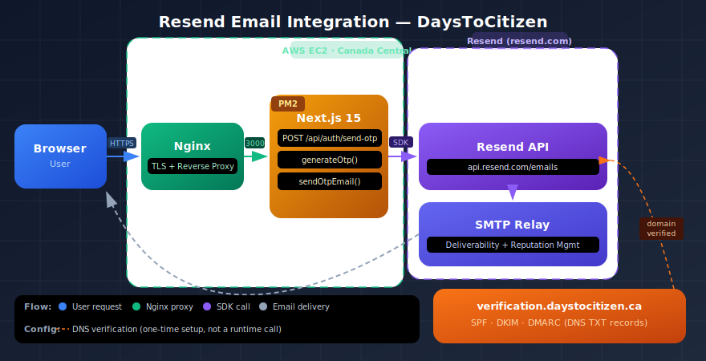

# Transactional Email Without the Headaches: How Resend Powered Authentication in DaysToCitizen

*A real-world look at using Resend to ship passwordless OTP login for a production web app — including domain verification, SPF/DKIM/DMARC, and why subdomains matter.*

---

## The Problem: Email Is Harder Than It Looks

When I built [DaysToCitizen](https://daystocitizen.ca) — a Canadian citizenship day tracker for immigrants — I needed users to authenticate securely. No passwords (too much friction for a tool people open once a month), no OAuth (adds an external dependency and assumes the user has Google or GitHub). The right call was **email OTP**: generate a 6-digit code, email it, and only create a session when the user proves they received it.

Simple concept. Painful execution — if you do it wrong.

The naive path is to use SMTP directly: grab a Gmail app password or an AWS SES credential, fire off emails from your server, and call it done. The problem is deliverability. Email has decades of trust infrastructure layered on top of it — SPF, DKIM, DMARC, IP reputation, domain reputation, bounce handling — and misconfiguring any one of these means your authentication emails land in spam, or worse, get dropped entirely. For a security-critical flow like OTP delivery, "might go to spam" is a product-ending bug.

I didn't want to become an email infrastructure expert. I wanted to ship. That's where **Resend** came in.

---

## What Resend Is

Resend is a developer-first email API built specifically for transactional email — the kind triggered by user actions, not marketing campaigns. Think password resets, account confirmations, receipts, and in our case, OTP codes.

It was founded by the team behind Loops (a marketing email tool) but spun out as a standalone product because transactional email has fundamentally different requirements: it needs to arrive immediately, reliably, and in the inbox, every single time.

The developer experience is intentional. The SDK is typed, the API is REST, errors are human-readable, and the dashboard surfaces exactly what you need: delivery status, bounce rates, and domain health — all in one place.

---

## Domain Verification: The Foundation of Deliverability

Before sending a single email, Resend requires you to verify ownership of your sending domain. This isn't bureaucracy — it's what makes your emails trustworthy to receiving mail servers.

For DaysToCitizen, I set up a **subdomain** specifically for transactional email: `verification.daystocitizen.ca`. Using a subdomain is best practice and a pattern Resend explicitly recommends. Here's why it matters:

Your main domain (`daystocitizen.ca`) has a web reputation built over time. If you send transactional email from the apex domain and something goes wrong — a batch of emails bounces, or a recipient marks one as spam — that reputation damage bleeds into your web traffic. A dedicated subdomain keeps email reputation isolated.

Resend walks you through adding three DNS records to your domain registrar:

- **SPF** (`TXT` record): Tells receiving mail servers that Resend is authorized to send email on behalf of your domain. Without this, you'll fail basic spam filters.
- **DKIM** (`TXT` record): A cryptographic signature that proves the email content wasn't tampered with in transit. Receiving servers verify the signature against a public key published in your DNS.
- **DMARC** (`TXT` record): A policy that tells receiving servers what to do when SPF or DKIM fails — reject, quarantine, or report. It also gives you a reporting address so you can monitor authentication failures.

The Resend dashboard shows you exactly which records to add, validates them in real time, and gives you a clear green "Verified" state once DNS propagates — typically within minutes to an hour.


---

## The Integration: Fewer Than 30 Lines

Once the domain was verified, wiring Resend into the Next.js app took about 20 minutes. Install the SDK (`npm install resend`), add the API key to your environment, and you're sending.

Here's the actual email sender from DaysToCitizen:

```typescript
const FROM = process.env.EMAIL_FROM ?? 'DaysToCitizen <noreply@verification.daystocitizen.ca>';

export async function sendOtpEmail(to: string, code: string): Promise<void> {
  const key = process.env.RESEND_API_KEY;

  if (!key) {
    // Development fallback: print to console instead of sending
    console.log(`OTP for ${to}: ${code}`);
    return;
  }

  const { Resend } = await import('resend');
  const resend = new Resend(key);

  await resend.emails.send({
    from: FROM,
    to,
    subject: `Your DaysToCitizen verification code: ${code}`,
    html: `<!-- branded HTML template with the 6-digit code -->`,
  });
}
```

The pattern of lazy-loading the Resend client (`await import('resend')`) is intentional — it means the SDK is only bundled server-side when `RESEND_API_KEY` is present, keeping the development loop fast and the test environment clean. No mocking required.

The `resend.emails.send()` call accepts `from`, `to`, `subject`, and `html`. That's it for the common case. The SDK is typed end-to-end, so TypeScript will tell you immediately if you misuse it.

---

## What the Dashboard Shows You

The Resend web panel is where the real operational value lives. After sending, every email appears in the **Emails** log with full delivery metadata: queued, delivered, bounced, or complained. You can filter by domain, date range, or recipient.

For an authentication flow, this is invaluable during debugging. If a user says "I didn't get the code," you can look up their email address, see exactly what happened at the delivery level, and rule out whether the issue is your code, Resend's infrastructure, or the recipient's mail server.


The **Domains** tab shows your verified sender domains with SPF, DKIM, and DMARC status at a glance — a real-time health indicator for your entire email setup.

---

## Architecture: Where Resend Fits in the Stack

The diagram below shows how Resend fits into DaysToCitizen's AWS-hosted architecture. The app runs on a single EC2 instance behind Nginx. When a user submits their email to sign in, the Next.js API route generates an OTP, stores it in the flat-file database, and makes an outbound HTTPS call to Resend's API. Resend handles the SMTP relay, reputation management, and delivery — the app never touches an SMTP server directly.



---

## Why This Matters for Side Projects Specifically

Full-stack authentication is one of those features that feels simple until you're deep in email deliverability forums at 11pm. Resend collapses what used to be a week of SMTP configuration, IP warm-up, and DNS archaeology into an afternoon. The free tier (3,000 emails/month) is more than enough for a v1 product. Paid tiers scale linearly.

For DaysToCitizen, the OTP auth flow has been running without a single deliverability complaint since launch. The code is 30 lines. The setup was one DNS session. The dashboard gives me full visibility.

That's the promise of developer-first infrastructure: you get production-grade reliability without becoming an ops engineer. Resend delivered on that promise.

---

*DaysToCitizen is open source. The full Resend integration lives in [`src/lib/email.ts`](../src/lib/email.ts).*
